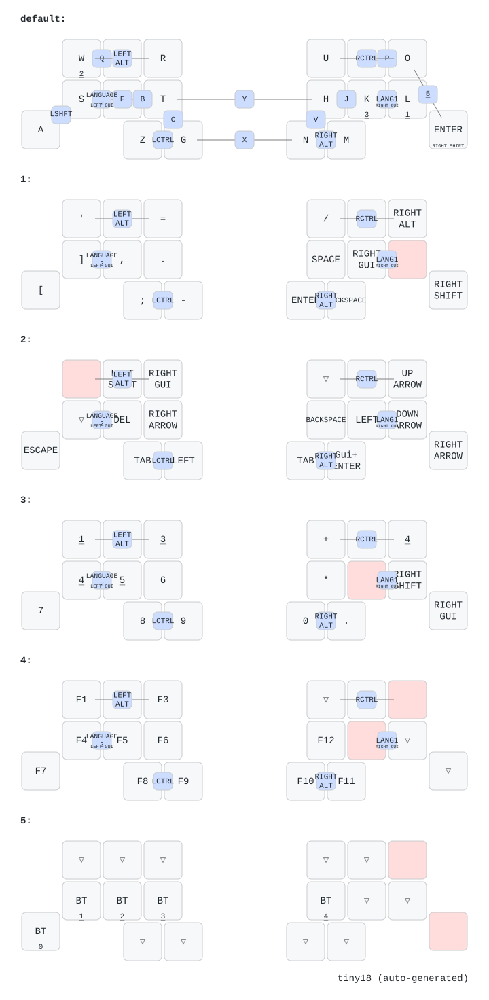

# Tiny18 ZMK firmware

ZMK firmware for [Tiny18](https://github.com/k3peta/tiny18), an 18-key wireless split keyboard using two Seeed Studio XIAO nRF52840 controllers.

日本語の説明は [`README.ja.md`](README.ja.md) を参照してください。

## Download

Most users should download the UF2 files from the [latest GitHub Release](https://github.com/k3peta/zmk-config-tiny18/releases/latest). Release assets do not expire, unlike temporary GitHub Actions artifacts.

| File | Target |
| --- | --- |
| `tiny18-right.uf2` | Right half; Bluetooth central and ZMK Studio host |
| `tiny18-left.uf2` | Left half; Bluetooth peripheral |
| `settings-reset.uf2` | Clears stored Bluetooth and split settings |
| `SHA256SUMS` | SHA-256 checksums for the three UF2 files |

The right and left files are not interchangeable. If the wrong image is flashed, enter the bootloader again and flash the correct image.

## Flashing

1. Turn the keyboard's battery power switch off and connect one half with a USB data cable.
2. Double-press the XIAO reset button. A drive named `XIAO-SENSE` should appear.
3. Copy `tiny18-right.uf2` to the right half and `tiny18-left.uf2` to the left half.
4. Disconnect USB, turn both halves on, and pair the Bluetooth device named `tiny18`.

For a first installation, or if the halves or host no longer pair correctly:

1. Flash `settings-reset.uf2` to both halves.
2. Double-press reset again on each half.
3. Flash the matching right and left firmware.
4. Remove any old `tiny18` entry from the host's Bluetooth settings, then pair again.

## Default keymap

The canonical keymap is [`config/tiny18.keymap`](config/tiny18.keymap). The repository's release automation builds that file without modifying it.

The keymap includes six layers, Japanese/English input switching combos, modifiers, Bluetooth profile selection, and ZMK Studio support. See the source file for the exact bindings and combo definitions.

## Build from source

GitHub Actions builds the three images automatically when firmware-related files change. The build is pinned to ZMK `v0.3.0` and `zmk-rgbled-widget` `v0.3.0` so a given commit remains reproducible.

To build a fork:

1. Fork this repository.
2. Enable GitHub Actions in the fork.
3. Edit `config/tiny18.keymap` if you want a custom layout.
4. Push the change and download the `firmware` artifact from the completed workflow run.

Actions artifacts are intended for testing and expire. Maintainers publish permanent downloads by pushing a version tag such as `v1.0.0`; [`release.yml`](.github/workflows/release.yml) builds that exact tag, creates checksums, and attaches the UF2 files to a GitHub Release.

### Build matrix

[`build.yaml`](build.yaml) produces:

- right half with RGB LED layer/battery widget and ZMK Studio over USB
- left half with RGB LED layer/battery widget
- settings-reset image for recovery

## Repository structure

| Path | Purpose |
| --- | --- |
| `config/tiny18.keymap` | Canonical default keymap |
| `config/tiny18_*.conf` | Per-half ZMK configuration |
| `boards/shields/tiny18/` | Tiny18 shield and direct-pin hardware definition |
| `build.yaml` | Firmware build matrix and stable artifact names |
| `keymap-drawer/` | Generated keymap diagram |
| `.github/workflows/build.yml` | Continuous build and diagram generation |
| `.github/workflows/release.yml` | Permanent, tagged firmware releases |

## Hardware

PCB production files, BOM, and fabrication notes are in the [Tiny18 hardware repository](https://github.com/k3peta/tiny18).

## License

Tiny18-specific firmware configuration and shield files are licensed under the [MIT License](LICENSE). ZMK and external modules are separate projects and retain their respective licenses.
